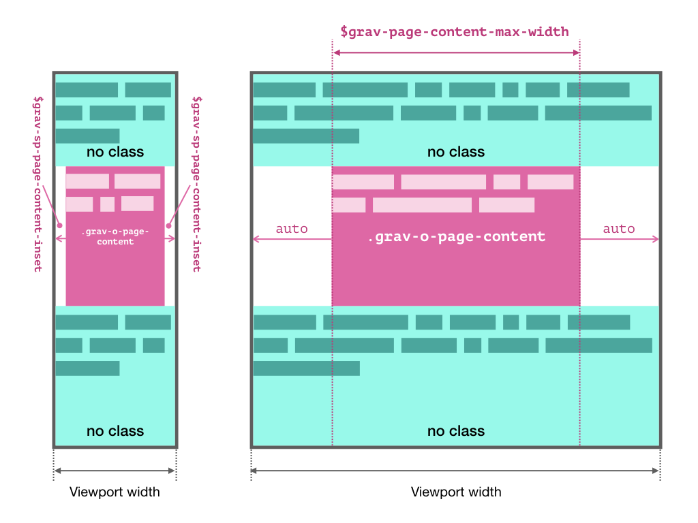
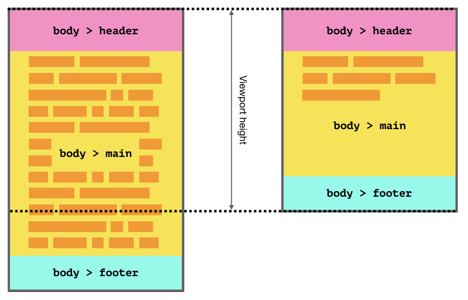

# Layout and grids

## Per-component rules
The following rules are designed to enable maximum re-use and flexibility of UI components. They also make it easier for future Gravity releases to evolve the overall look and feel, without needing to make lots of per-component changes.

All UI components should:

* **Participate in the normal layout flow**
    * In other words, they should not themselves use things like absolute positioning, be floated or any other CSS technique that takes them out of the normal layout flow.
    * They can and should of course use whatever layout techniques they like internally to lay out their respective child elements and nested components.
* **Not set an explicit width on themselves**
    * Block components should expand horizontally ot fill the space provided by their parent. So standard `display: block;` behaviour or equivalent.
    * Non-block components (e.g. inline ones) should expand horizontally to fit their content
* **Not set an explicit height on themselves**
    * Content within a component must always be fully accessible and should therefore never be cropped or obscured. Generally, the easiest way to achieve this is to simply allow elements to follow their natural behaviour of expanding vertically to fit the content within them.
* **Not set explicit outer margins on themselves**
    * It is the responsibility of global rules and/or parent components to set correct spacing between components. If individual components were to set explicit margins themselves, that would interfere.
* **Not hard code values for space, borders, sizes, etc.**
    * Most of the time the inherited defaults will set the correct widths, heights, font-sizes, etc., so those properties should not be explicitly set unless you intentionally want to override the default.
    * When you do override properties, never hard code the values but instead reference the appropriate SASS variable or CSS custom property provided by Gravity. For instance, don't do `padding: 1rem;` but instead do `padding: $grav-sp-m;`.
    * If none of the available variables give you what you need, please contact the [Gravity maintainers](https://github.com/orgs/buildit/teams/gravity-maintainers) - if there's a good case for it, we can always add more global variables so that others can also benefit from them.
    

## Global layout rules
### Vertical spacing and typography
Our CSS approach is inspired by [Heydon Pickering](http://www.heydonworks.com/)'s "[Axiomatic CSS and Lobotomized Owls](https://alistapart.com/article/axiomatic-css-and-lobotomized-owls)" article.

We therefore have a global "lobotomized owl" (`* + *`) CSS rule that sets a default vertical `margin-top` _between_ successive block elements, but not above the first element. Components and pages are encouraged to just let this rule do its thing as much as possible and only selectively override it when absolutely necessary.

The SASS variable `$grav-sp-vertical-gap` defines the size of this standard vertical gap.

Similarly, all components inherit `font-family` and `line-height` by default. As much as possible you should accept these values. Only override them when you have good reason to do so.

### Max-width for page content
Page contents are generally "boxed in". On small viewports there is a standard outer margin (defined by `$grav-page-content-inset`) to separate the edge of the screen or browser window from text and other content. But once the viewport exceeds a certain width, that page content gets locked to a fixed width (defined by `$grav-page-content-max-width`) and appears centered within the viewport.

However, occasionally there is a need for "full-bleed" elements that span the entire width of the viewport. This can be tricky to achieve when page contents are boxed in by default since you need to overflow your container. Therefore, **by default everything is full-bleed**. Page authors must explicitly apply the `.grav-o-page-content` class to their outermost container elements that should be boxed in.

Note that **nesting elements with `grav-o-page-content` is not supported** as it will create oversized margins on small viewports.

### Sticky footer
Gravity expects that your page or application declares `<header>`, `<main>` and `<footer>` elements as _direct_ children of the `<body>` for the page or app's main header, content and footer respectively.

To avoid an unattractive empty gap _below_ the page footer, you can apply the `.grav-o-sticky-footer` class to the `<body>` element. This will push the footer down to sit flush the bottom edge of the viewport on short pages. This is done by making the `<body>` element (or whatever element the class was applied to) a flexbox column with a minimum height of `100vh` and then setting the `<main>` child element to grow vertically, filling any excess sapce and pushing the footer downwards. On pages where the content exceeds the height of the viewport, the page scrolls as usual.

If, for some reason, your footer needs to be wrapped in another element, you can alternatively use the `.grav-o-sticky-footer__footer` class on the whatever element needs to be pushed down to the bottom of the viewport. Likewise, if `<main>` is not a direct child of the sticky footer container, you can apply the `.grav-o-sticky-footer__main` class to the equivalent element.

These elements also have the default vertical gap removed, so that they sit flush against each other.
